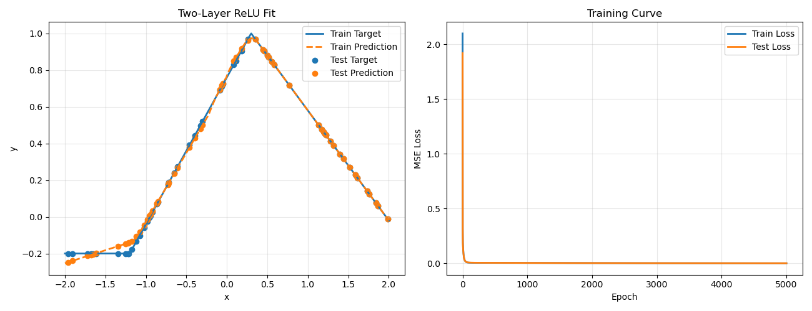
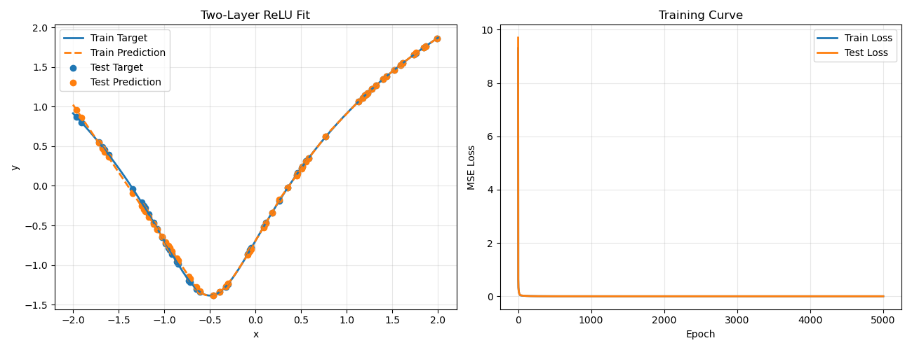
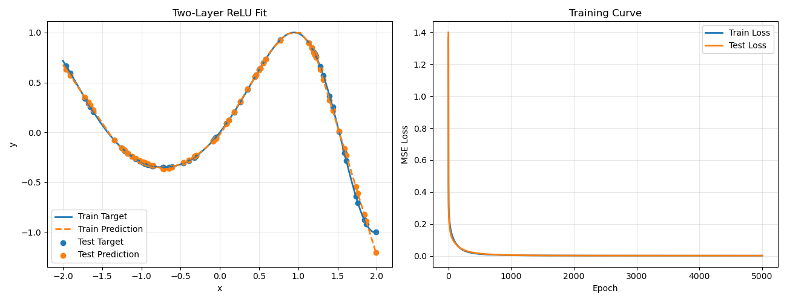

# 基于自定义 MyTensor 的两层 ReLU 神经网络函数拟合实验报告

## 1. 实验目的

本实验基于numpy自定义实现的自动梯度机制，搭建一个两层 ReLU 神经网络，并验证其对多种一维非线性函数的拟合能力。实验重点包括：

- 使用自定义 Tensor 完成前向传播、损失计算和反向传播
- 在训练集和测试集上观察模型的收敛过程
- 验证两层 ReLU 网络是否能够模拟自定义函数

## 2. 代码说明

代码的主要设置如下：

- 定义了 3 个目标函数 `target_function1`、`target_function2`、`target_function3`
- 使用 `build_dataset(num_points=300)` 在区间 `[-2, 2]` 上均匀采样生成数据
- 使用 `split_dataset(xs, ys, train_ratio=0.80, seed=0)` 将数据划分为 80% 训练集和 20% 测试集
- 使用两层 ReLU 网络进行拟合，隐藏层宽度为 48
- 训练轮数为 5000，学习率为 0.03
- 每 500 轮输出一次训练损失和测试损失
- 训练结束后输出 `train mse`、`test mse` 和 `test max abs error`

## 3. 目标函数定义

本次实验共测试了 3 个不同类型的函数。

### 3.1 分段线性函数

```python
def target_function1(x):
    return (
        0.8 * np.maximum(0.0, x + 1.2)
        - 1.4 * np.maximum(0.0, x - 0.3)
        - 0.2
    )
```

这个函数本身由若干 ReLU 形式的分段线性项组合而成，因此理论上非常适合用两层 ReLU 网络进行拟合。

### 3.2 对数函数

```python
def target_function2(x):
    return np.log(x**2 + x + 1 / 2)
```

这是一个平滑的非线性函数，用于验证两层 ReLU 网络对连续曲线的逼近能力。

### 3.3 振荡函数

```python
def target_function3(x):
    return np.sin(0.7 * x**2 + x)
```

这个函数同时包含非线性和振荡特性，拟合难度高于前两个函数，可用于测试模型对复杂函数的表达能力。

## 4. 数据采集与划分

数据不是从外部文件读取，而是通过目标函数直接生成。具体方式如下：

- 输入样本：在区间 `[-2, 2]` 上均匀采样 300 个点
- 输出标签：由对应的目标函数计算得到
- 训练集：240 个样本，占 80%
- 测试集：60 个样本，占 20%

代码中对样本索引进行了随机打乱，然后再按比例切分。这样可以避免训练集和测试集在区间上过于集中，有助于更公平地评估泛化能力。

## 5. 模型描述

模型为一个两层全连接 ReLU 神经网络：

- 输入维度：1
- 隐藏层维度：48
- 激活函数：ReLU
- 输出维度：1

前向传播形式为：

```python
hidden = (x @ w1 + b1).relu()
output = hidden @ w2 + b2
```

损失函数使用均方误差：

```python
MSE = mean((pred - target) ** 2)
```

训练时通过 `MyTensor.backward()` 自动完成反向传播，再使用梯度下降更新参数。

## 6. 训练结果

训练日志保存在`output.txt`文件中。三组函数的最终指标如下：

| 函数 | Train MSE | Test MSE | Test Max Abs Error | 结果评价 |
| --- | ---: | ---: | ---: | --- |
| `target_function1` | 0.000302 | 0.000352 | 0.059340 | 拟合效果最好，预测曲线与真实曲线很接近 |
| `target_function2` | 0.000745 | 0.000642 | 0.089236 | 对平滑函数拟合稳定，测试误差较小 |
| `target_function3` | 0.001051 | 0.001258 | 0.196286 | 对复杂振荡函数也能较好拟合，但误差明显高于前两者 |

从 loss 变化来看，三组实验的训练损失和测试损失都随着迭代逐步下降，并在后期趋于平稳，说明网络训练过程稳定，没有明显过拟合。

## 7. 拟合效果分析

### 7.1 function1 拟合结果

该函数本身具有分段线性结构，与 ReLU 网络的表达形式非常接近，因此拟合效果最好。训练和测试误差都非常小。



### 7.2 function2 拟合结果

对于对数函数，模型也表现出了较强的逼近能力。虽然 ReLU 网络本质上由分段线性单元构成，但通过足够的隐藏神经元，仍能较好地逼近平滑曲线。



### 7.3 function3 拟合结果

第三个函数包含更强的非线性和振荡特征，拟合难度最高。从结果看，网络已经学习到了整体趋势。



## 8. 结论

本实验基于自定义 Tensor 成功实现了两层 ReLU 神经网络，并在 3 种不同函数上完成了拟合验证。结果表明：

- 对于分段线性函数，两层 ReLU 网络可以非常精确地拟合
- 对于平滑非线性函数，模型同样具有较好的逼近效果
- 对于更复杂的振荡函数，模型仍然能够学习整体趋势，但误差会相对增大

整体来看，自定义 `MyTensor` 已经能够支持基本的神经网络训练流程，并验证了两层 ReLU 网络拥有模拟任何函数的能力。
