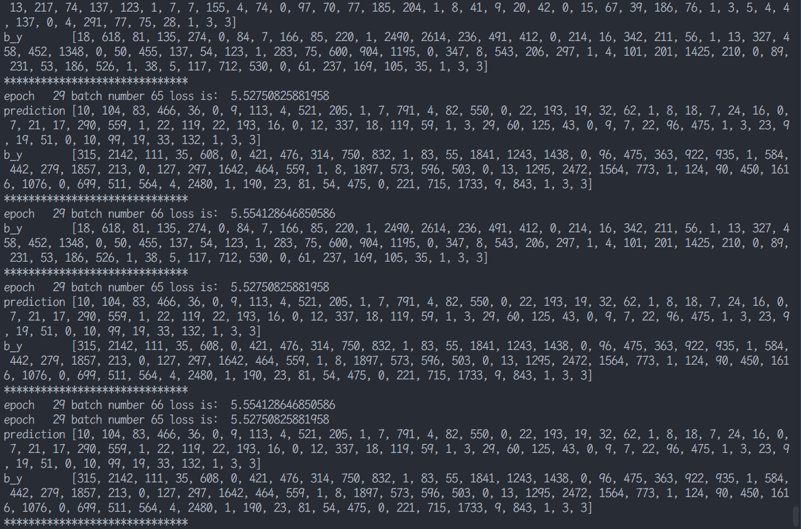
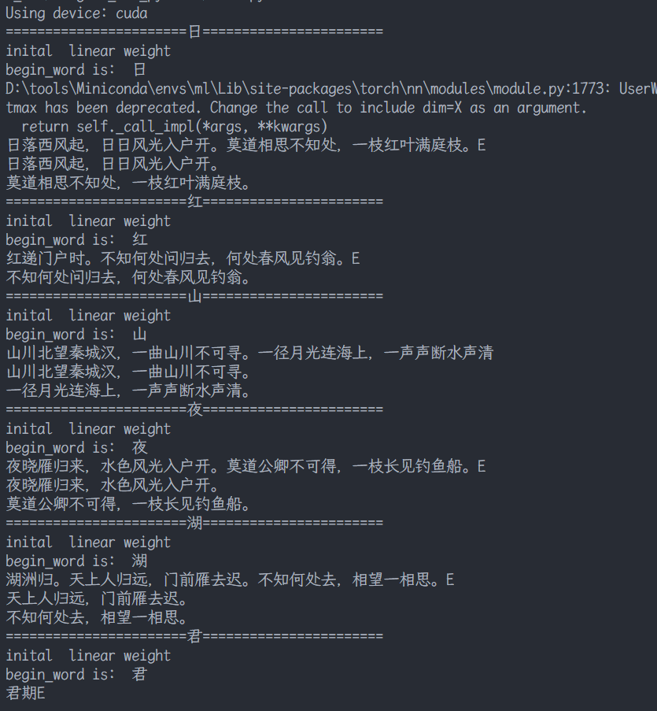

# 唐诗生成实验总结

## 模型对比

### 1. RNN（循环神经网络）

**模型概述**  
RNN是一类用于处理序列数据的神经网络，通过循环连接保留历史信息，适合时间序列、文本等变长序列任务。

**主要结构**  
- 隐藏层神经元之间存在循环连接，当前时刻的隐藏状态 \( h_t = \tanh(W_{xh}x_t + W_{hh}h_{t-1} + b) \)。
- 同一组参数在时间步上共享，每个时间步输出 \( y_t \)（可选）。

**特点**  
- **优点**：能处理任意长度序列，参数共享，计算高效。
- **缺点**：**梯度消失/爆炸**问题严重，难以捕捉长距离依赖（一般只能记忆5-10步）。
- 训练常使用BPTT（随时间反向传播），需配合梯度裁剪。

### 2. LSTM（长短期记忆网络）

**模型概述**  
LSTM是RNN的改进版本，专门设计门控机制来解决长序列训练中的梯度消失问题，能有效记忆长期信息。

**主要结构**  
- 引入**细胞状态** \( C_t \) 作为“传送带”，保留长期信息。
- 三个门控单元：
  - **遗忘门** \( f_t \)：决定丢弃哪些旧信息。
  - **输入门** \( i_t \)：决定添加哪些新信息，并生成候选值 \( \tilde{C}_t \)。
  - **输出门** \( o_t \)：决定输出哪些隐藏状态 \( h_t \)。
- 更新公式：\( C_t = f_t \odot C_{t-1} + i_t \odot \tilde{C}_t \)，\( h_t = o_t \odot \tanh(C_t) \)。

**特点**  
- **优点**：有效解决长期依赖问题（可记忆上百步），缓解梯度消失，实践中表现强大。
- **缺点**：结构复杂，参数量多（4组参数），训练较慢，容易过拟合。
- 是许多序列任务（机器翻译、语音识别）的默认选择之一。

### 3. GRU（门控循环单元）

**模型概述**  
GRU是LSTM的简化变体，2014年提出，将遗忘门和输入门合并，减少门控数量，在保持性能的同时提高计算效率。

**主要结构**  
- 两个门控单元（无独立细胞状态，直接通过隐藏状态传递）：
  - **更新门** \( z_t \)：控制从前一状态保留多少信息，以及加入多少候选新信息。
  - **重置门** \( r_t \)：控制忽略前一状态的程度。
- 隐藏状态更新：\( h_t = (1 - z_t) \odot h_{t-1} + z_t \odot \tilde{h}_t \)，其中 \( \tilde{h}_t = \tanh(W x_t + U (r_t \odot h_{t-1})) \)。

**特点**  
- **优点**：结构比LSTM简单（少一个门），参数更少（约LSTM的75%），训练更快，在中小数据集上常与LSTM性能相当或更好。
- **缺点**：表达能力略弱于LSTM（因为缺少独立细胞状态），但多数任务差距不大。
- 适合对训练速度或模型大小有要求的场景。


## 2. 模型架构
### 一、整体架构概述

本唐诗生成模型采用经典的Encoder-Decoder架构，基于双层LSTM网络，使用pytorch框架实现。模型主要由词嵌入层、LSTM循环层、全连接层和输出层组成，完整实现了从汉字索引到唐诗生成的端到端解决方案。

### 二、各层详细解析

#### 1. 词嵌入层（word_embedding）

```python
class word_embedding(nn.Module):
    def __init__(self, vocab_length, embedding_dim):
        super(word_embedding, self).__init__()
        w_embeding_random_intial = np.random.uniform(-1, 1, size=(vocab_length, embedding_dim))
        self.word_embedding = nn.Embedding(vocab_length, embedding_dim)
        self.word_embedding.weight.data.copy_(torch.from_numpy(w_embeding_random_intial))
    
    def forward(self, input_sentence):
        sen_embed = self.word_embedding(input_sentence)
        return sen_embed
```

**功能与原理**：
- 将离散的汉字索引转换为连续的向量表示
- 初始化为均匀分布的随机向量，训练过程中不断优化
- 嵌入维度设置为100，平衡表达能力和计算成本
- 输出形状：`(batch_size, sequence_length, embedding_dim)`

#### 2. LSTM循环层

```python
self.lstm = nn.LSTM(embedding_dim, lstm_hidden_dim, num_layers=2, batch_first=True)
```

**功能与原理**：
- 采用双层LSTM结构，捕捉诗句的上下文依赖关系
- 输入维度：100（词嵌入维度）
- 输出维度：128（LSTM隐藏层维度）
- `batch_first=True`：输入输出形状为`(batch_size, sequence_length, hidden_dim)`
- 每层LSTM包含输入门、遗忘门、输出门和细胞状态，有效解决长序列依赖问题

#### 3. 全连接层与输出层

```python
self.fc = nn.Linear(lstm_hidden_dim, vocab_len)
self.softmax = nn.LogSoftmax()
```

**功能与原理**：
- 全连接层将LSTM输出映射到词汇表大小的维度
- LogSoftmax激活函数输出下一个汉字的概率分布
- 训练阶段使用负对数似然损失函数优化模型
- 生成阶段通过argmax选择概率最大的汉字作为预测结果

#### 4. 模型初始化


```python
def weights_init(m):
    classname = m.__class__.__name__
    if classname.find('Linear') != -1:
        weight_shape = list(m.weight.data.size())
        fan_in = weight_shape[1]
        fan_out = weight_shape[0]
        w_bound = np.sqrt(6. / (fan_in + fan_out))
        m.weight.data.uniform_(-w_bound, w_bound)
        m.bias.data.fill_(0)
```

**功能与原理**：
- 采用Xavier初始化方法初始化全连接层参数
- 权重初始化为均匀分布，范围为`[-sqrt(6/(fan_in+fan_out)), sqrt(6/(fan_in+fan_out))]`
- 偏置初始化为0，确保模型训练初期稳定性

### 三、模型工作流程

```
汉字索引 → 词嵌入层 → LSTM循环层 → 全连接层 → Softmax输出 → 汉字预测
```

1. **输入处理**：将诗句转换为汉字索引序列
2. **词嵌入**：将索引转换为连续向量表示
3. **LSTM编码**：双层LSTM捕捉诗句上下文信息
4. **输出预测**：全连接层映射到词汇表维度，Softmax输出概率分布
5. **生成诗歌**：根据预测概率选择下一个汉字，重复生成完整诗句

## 四、训练与生成细节

### 训练阶段
- 批处理大小：512
- 优化器：RMSprop，学习率0.01
- 损失函数：负对数似然损失（NLLLoss）
- 梯度裁剪：防止梯度爆炸，最大范数1.0
- 模型保存：每20个批次保存一次模型状态

### 生成阶段
- 输入起始汉字（如“日”、“红”等）
- 循环预测下一个汉字，直到生成结束标记或达到最大长度
- 后处理：去除特殊标记，格式化输出诗句

## 3. 实验结果

### 部分训练过程


### 唐诗生成结果



### 生成诗歌示例

#### 以“日”开头：
日落西风起，日日风光入户开。
莫道相思不知处，一枝红叶满庭枝。

#### 以“红”开头：
红递门户时。不知何处问归去，何处春风见钓翁。

#### 以“山”开头：
山川北望秦城汉，一曲山川不可寻。
一径月光连海上，一声声断水声清。

#### 以“夜”开头：
夜晓雁归来，水色风光入户开。
莫道公卿不可得，一枝长见钓鱼船。

#### 以“湖”开头：
湖洲归。天上人归远，门前雁去迟。不知何处去，相望一相思。

**可以看到，模型输出的诗歌大部分具有一定的格律和意境，但也存在一定不符合格式和语法、不通顺的情况。**

## 实验总结
本实验成功实现了基于LSTM的唐诗生成模型，通过GPU加速训练显著提升了训练效率。生成的诗歌在格律和意境上基本符合唐诗风格，展示了循环神经网络在序列生成任务中的强大能力。实验结果表明，LSTM能够有效捕捉唐诗的语言模式和韵律特征，生成具有一定文学价值的诗歌作品。